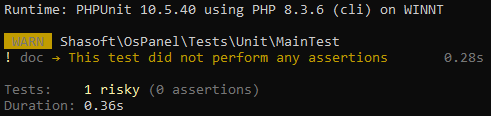
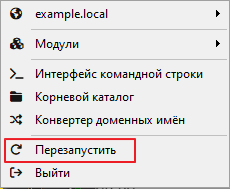
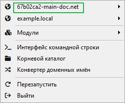
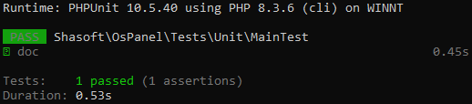

# Трейт для работы с WAMP OSPanel

Пакет предназначен для выполнения тестов с http запросами на основе веб-сервера [ospanel.io](https://ospanel.io).
Позволяет автоматизировать создание проектов в OSPanel. Трейт `Shasoft\OsPanel\TraitOsPanel` добавляет следующие методы:
```php
trait TraitOsPanel
{
    // Возвращает TRUE если выполнение происходит в среде OSPanel
    protected function osPanelHas(): bool;
    // Создаёт домен и возвращает его для использования в запросе
    // В качестве параметра принимает директорию где расположен код сайта
    protected function osPanelHostCreate(string $filepath): string;
    // Проверяет: домен активен для выполнения запросов к нему?
    protected function osPanelHostHas(string $host): bool;
}    
```

Пример использования
```php
public function testDoc(): void
{
    // Создадим домен и привяжем к нему директорию сайта
    $host = $this->osPanelHostCreate(__DIR__ . '/../../test-site');
    // Домен активен для выполнения запросов?
    if ($this->osPanelHostHas($host)) {
        // Сформируем URI для выполнения запроса
        $uri = 'https://' . $host . '/get';
        // Выполним запрос
        $response = $this->client->get($uri);
        // Обработаем результата запроса
        self::assertEquals(200, $response->getStatusCode());
    }
}
```
Результат выполнения:


Домен для тестов был создан в OSPanel, но запрос не выполнялся, так как домен не активен. Чтобы его активировать необходимо перезапустить WAMP OSPanel

и тогда новый тестовый домен станет активен. 


Имя домена формируется автоматически по имени теста:
`<хэш пространства имен>-<имя класса теста>-<имя метода теста>.net`

После перезапуска при повторном запуске теста запросы будут выполнены и результат проверен на корректность


Работа проверена на следующих версиях:
* Open Server Panel v6.0.0 x64 05.05.2024 18:22:30